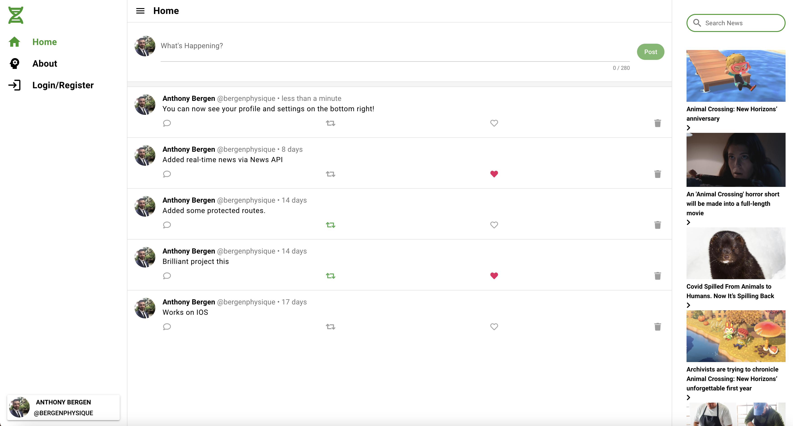

<h1 align="center">
Blogology
</h1>
<h4 align="center" style="margin-bottom:10px">Be sure to star my configuration repo so you can keep up to date on any daily progress!</h4>
<div align="center">
  <h4>
    </a>
    <a href="https://github.com/adbergen/blogology/stargazers"></a>
    <a href="https://github.com/adbergen/blogology/commits/master"></a>
        <a href="https://github.com/adbergen/blogology/commits/master"></a>
</h4>
<br>
</div>
<p align="center"><font size="3">
This is a vue.js quasar blogging application deployed to Mac, Windows, IOS, and Android.</p>
<div align="center"><a name="menu"></a>
  <h4>
    <a href="https://github.com/adbergen/blogology">
      Github Repository
    </a>
<span> | </span>
<a href="https://adbergen.github.io/blogology/">
      Github Pages
    </a>
  </h4>
</div>



<hr>

## Table of Contents

- [Installation](#installation)
- [Usage](#usage)
- [Technologies](#technologies)
- [Contributing](#contributing)

<hr>

## Installation

### Install the dependencies

```bash
npm install
```

### Start the app in development mode (hot-code reloading, error reporting, etc.)

```bash
quasar dev
```

### Lint the files

```bash
npm run lint
```

### Build the app for production

```bash
quasar build
```

### Customize the configuration

See [Configuring quasar.conf.js](https://quasar.dev/quasar-cli/quasar-conf-js).

<hr>

## Usage

<p> This application is designed to allow a user to login and post blog posts personal to them.

<hr>

## Technologies

<ul>
<li>Quasar, HTML, CSS, Sass</li>
<li>Animate.css, date-fns, gravatar, Material Design, Font Awesome </li>
<li>JavaScript, jQuery</li>
<li>Firebase</li>
<li>Vue.js, Node.js, Express.js</li>
<li>GitHub, Cordova, Electron</li>
</ul>

<hr>

## Contributing

- Pull requests are welcome. For major changes, please open an issue first to discuss what you would like to change.

- Contributors: Anthony Bergen

<hr><hr>
